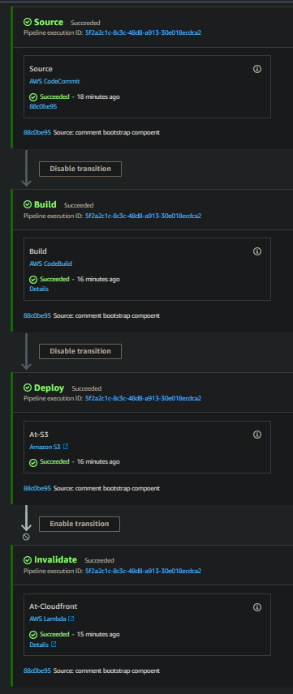

## Invalidate S3 Bucket Objects With Lamdba Function
---

### Pre-requisites
---
Should have the following installed at your system:

- Python3 version: 3.10.10
- Pip3 installed
- `aws-cli` : 2.6.0
- programatic access credentials with a default profile set.

### Steps at local machine
---
1. Run `pip3 freeze` to generate required packages at your environment.
2. Create a .env file with the following key:=value pairs:

    - CLOUDFRONT_DISTRIBUTION_ID
    - INVALIDATION_PATH

3. Run python script using `python main.py`

### Steps Using Lambda Function
---
1. Create a lambda function named `invalidate_s3_objects`, however you can have any name you want.
2. Create a role named `Lambda_Service_role` and create a policy named `CF_Lambda_Iam_Policy` with the following services and actions:

    - Codepipeline
        - `PutJobSuccessResult`
        - `PutJobFailureResult`
    - Cloudwatch Logs
        - `logs:CreateLogStream`
        - `logs:CreateLogGroup`
        - `logs:PutLogEvents`
    - Cloudfront
        - `cloudfront:GetInvalidation`
        - `cloudfront:CreateInvalidation`
     
    Once you have the role and its policy document, add the `execution-role` at,
    
    - Function > invalidate_s3_objects > Configuration > Permissions > Edit > *select_your_role_name*

3. Add environment variable at : Function > invalidate_s3_objects > Configuration > Environment variables
4. Package your source code as `zip` file:
    - lambda_function.py
    - requirements.txt

    *Note*: you can name the zip file with any name.
5. Upload package.zip as zip file at invalidate_s3_objects lambda function.
6. Test using event pattern using `codepipeline-job` template, make sure you are passing your s3 bucket object key to `UserParameters`.

### Resources & Documentation
---
Here are some useful documentation resources to get you up to speed.

- https://docs.aws.amazon.com/AmazonS3/latest/userguide/notification-content-structure.html
- https://boto3.amazonaws.com/v1/documentation/api/latest/reference/services/cloudfront/client/create_invalidation.html
- https://docs.aws.amazon.com/lambda/latest/dg/lambda-python.html
- https://docs.aws.amazon.com/lambda/latest/dg/services-codepipeline.html
- https://boto3.amazonaws.com/v1/documentation/api/latest/guide/error-handling.html